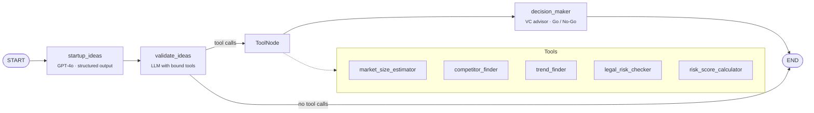

# 🚀 Startup Idea Validator

**An agentic LangGraph workflow that generates startup ideas for any domain, researches each one with tool-calling agents, and returns a VC-style Go / No-Go verdict.**


---

## Overview

Validating a startup idea means answering the same questions every time: *How big is the market? Who are the competitors? Is it on-trend? What could get us sued? How risky is it?*

This project turns that checklist into a **multi-step LLM agent pipeline**. You enter a domain such as `healthcare`. The system then:

1. **Ideates.** It generates three startup ideas as structured output (a Pydantic schema).
2. **Researches.** A *Market Research Expert* agent decides which research tools to call for each idea and runs them.
3. **Decides.** A separate *VC Advisor* agent reviews the research and gives a firm **Go / No-Go** with reasons.

Every step streams to a Streamlit UI as it happens, so you can watch the agent think, call tools and reach a verdict.

## Architecture



| Node | Responsibility | Key technique |
|---|---|---|
| `startup_ideas` | Generate 3 concise ideas for the domain | `llm.with_structured_output(StartupIdeas)` with a Pydantic model, which guarantees a parseable list |
| `validate_ideas` | Plan and request market research | `llm.bind_tools(tools)` with a strict "research only, no opinions" persona prompt |
| `tools` | Run the requested research calls | LangGraph `ToolNode` with `tools_condition` routing |
| `decision_maker` | Turn the research into a decision | A separate "VC Advisor" persona with a fixed response template |

Shared state is a typed `TypedDict` (`user_input`, `domain`, `startup_ideas_list`, `messages`). The `add_messages` reducer keeps the full conversation trace across nodes.

## Design decisions

- **Research and judgment are kept apart.** The researcher prompt is told never to give opinions, and the decision-maker is told never to redo research. Two narrow personas give more consistent, auditable output than one agent that both researches and decides.
- **Structured output at the start.** Generating ideas as a schema instead of free text removes fragile parsing, and the list flows straight into later nodes.
- **Tools return content and data separately.** Each tool uses `response_format="content_and_artifact"`. The LLM reads a natural-language summary while the raw data stays available as an artifact for the UI or later processing.
- **Data sources can be swapped.** Every tool takes a `mock` flag. The `mock=False` branch is where real data sources (market-research APIs, web search, legal databases) connect, without changing the graph.

## Output format

The decision node always answers in a fixed, easy-to-scan format. This illustrative example uses the built-in `healthcare` research data:

```text
Idea: AI-powered remote patient monitoring for chronic care
Decision: Go
Reasoning:
- Market Potential: $10B market growing at 12% CAGR, a large and expanding opportunity
- Competitive Landscape: established players (MediTech, HealthFirst), but room to differentiate
- Trend Alignment: strongly aligned with Remote Patient Monitoring and AI Diagnostics
- Legal or Execution Risk: risk score 5/10; HIPAA and patient-data privacy need to be designed in
- Summary: Large, growing market with clear trend tailwinds; proceed with compliance-first design.
```

## Quickstart

```bash
git clone https://github.com/JYOTSNACHOUDHARY/startupIdeaGenerator.git
cd startupIdeaGenerator

python -m venv .venv && source .venv/bin/activate
pip install -r requirements.txt streamlit

export OPENAI_API_KEY="sk-..."
streamlit run app.py
```

Open the local URL Streamlit prints, enter a domain (for example `education`, `healthcare` or `fitness`), and click **Generate & Validate Ideas**.

## Project structure

```text
startupIdeaGenerator/
├── app.py                      # Streamlit UI that streams graph events
├── orchestrator/
│   └── graph.py                # LangGraph StateGraph: nodes, edges, routing
├── prompts/
│   ├── startup_validator.py    # Market Research Expert prompt (research only)
│   └── decision_maker.py       # VC Advisor prompt (Go / No-Go)
├── tools/
│   ├── market_size_estimator.py
│   ├── competitor_finder.py
│   ├── trend_finder.py
│   ├── legal_risk_checker.py
│   └── risk_score_calculator.py
└── requirements.txt
```

## Current status and roadmap

The orchestration, prompting and UI are complete. **The research tools currently return sample data** for the `healthcare`, `fitness` and `education` domains, with generic fallbacks for other domains. The risk score is simulated. This keeps the agent flow fully testable without paid data APIs.

- [ ] Connect real data sources behind `mock=False` (web search such as Tavily or SerpAPI, plus market and company databases)
- [ ] Turn on LangSmith tracing for agent runs (already in `requirements.txt`)
- [ ] Persist runs with LangGraph's SQLite checkpointer (already in `requirements.txt`)
- [ ] Add an evaluation set to measure how consistent the decisions are across runs
- [ ] Research ideas in parallel with a map-reduce branch in the graph

## Tech stack

**LangGraph** (state graph, `ToolNode`, conditional routing) · **LangChain** (tools, prompt templates, `init_chat_model`) · **OpenAI GPT-4o** · **Pydantic** (structured output) · **Streamlit** (streaming UI)

---

<p align="center">Built by <a href="https://github.com/JYOTSNACHOUDHARY">Jyotsna Choudhary</a> · <a href="https://www.linkedin.com/in/jyotsna-c/">LinkedIn</a> · <a href="https://www.youtube.com/@LearnHiddenLayers">YouTube</a></p>
